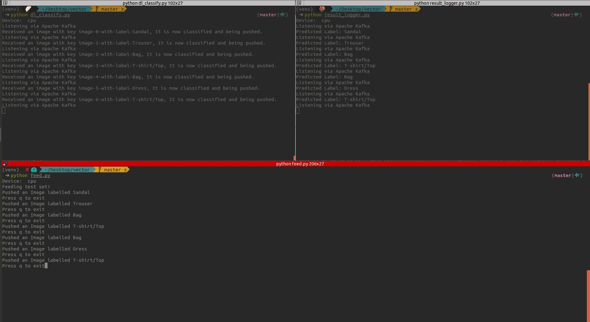

__Part 3 :)__

Currently Kafka is being used but can be changed to pubsub in config.py

- __`feed.py`__ - feeds test images one by one (by pressing enter) and publishes to test topic
- __`dl_classify.py`__ - Receives the image from test topic, classifies and publishes to results topic
- __`result_logger.py`__ - Prints the label received from results topic

- __`unified_api.py`__ - Contains a class for the unified api an argument as a string
- __`unified_api_publisher.py`__ - Driver script to use the __unified_api__ and as a publisher you can select __kafka__ service or __pubsub__ service by passing it as an argument
- __`unified_api_subscriber.py`__ - Driver script to use the __unified_api__ and as a subscriber you can select __kafka__ service or __pubsub__ service by passing it as an argument

-  __utils__ - This folder contains publisher and subscriber classes for both pubsub and kafka services 
   - __`apache_kafka.py`__ - Contains a class for kafka publisher and kafka subscriber
   - __`google_pub_sub.py`__ - Contains a class for gcp publisher and gcp subscriber
   - __`dataset.py`__ - This python file contains a class that loads the data and returns the data loaders
   - __`network.py`__ - Python file that contains the network architectures as classes
   - __`trainer.py`__ - Python file that contains a generic class for training


### Working



1. ```virtualenv -p python3 venv```
2. ```source venv/bin/activate```
3. ```pip install -r requirements.txt```
4. open a terminal and run ```python dl_classify.py```
5. open a terminal and run ```python result_logger.py```
6. open a terminal and run ```python feed.py``` and enter to push a new test image

### Note

1. Please check part1 and part2 branches for the classifer and unified api part